# r2con2025
## "back to the roots"

Welcome back to your favorite conference around the radare reverse engineering framework!

This time we are making it **fully online**, so you don't have to worry about booking flights or hotels, grab some popcorns and join the chats and watch the stream!

* **Event Date**: October 24, 25 [ICAL](talks/r2con2025.ics)
* **Location**: [YouTube](https://youtube.com/r2con)/[Discord](/discord)/[Telegram](https://t.me/r2con2025)
* **HashTag**: Fediverse [#r2con2025](https://infosec.exchange/tags/r2con2025)

Check out the [materials and slides](https://github.com/radareorg/r2con2025)

Check the schedule; it's magically adjusted to your local time!

SCHEDULE

## Presentations

# Friday

### <a name="welcome">Welcome to r2con2025</a>

(pancake)

Lots of things has changed in a year, reading git log can be boring and release notes are usually not explicative enough to catch all the juicy improvements the whole radare2 ecosystem provides. This talk will cover you up and you will learn all the stuff you missed as well as spoiling some of the future plans in the roadmap

### <a name="mobile">Using r2 to Uncover Mobile App Weaknesses</a>

(grepharder)

In this talk we'll dice into common mobile app weaknesses from the OWASP MASWE catalogue and demonstrates how to uncover them in practice. Using radare2 and other essential tools from the OWASP MASTG, we will solve reverse engineering challenges and validate MASTG tests step by step. All challenges will be available as APK and IPA files for hands-on practice. Will we also use AI to tackle some of these challenges? Maybe.

### <a name="rust">Crack Rust with r2ai</a>

(cryptax)

Have you ever reversed Rust binaries? No? Lucky you! Simple code turns into 600+ functions, and many of its concepts have impact on the way to reverse it: println is a macro, strings are fat pointers, compiler uses monomorphization... So, how can we solve a Rust CrackMe? We are going to use r2ai - r2's Artificial Intelligence plugin. It helps, but we'll nevertheless need practice and brains ;P

<a href="day1">
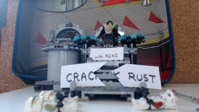
</a>

### <a name="vibe">VibeReversing binaries with r2mcp</a>

(pancake)

AI is rapidly transforming the way we work, and MCPs open the door for agents to seamlessly use tools and tackle complex problems. They not only help users learn new tools without digging through documentation but also provide a powerful way to accelerate reverse engineering workflows across diverse toolchains.

<a href="day1">
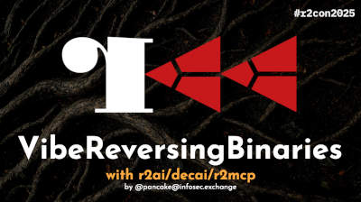
</a>

### <a name="inspect">Rapid Insights for Malware Analysts</a>

(seifreed)

Presenting `r2inspect`: a framework for static malware analysis built on top of radare2 and r2pipe, providing accurate detection of obfuscated strings, cryptographic signatures, exploit mitigation analysis, and more

<a href="day1">
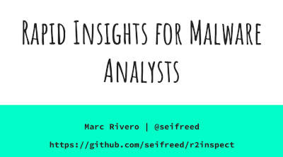
</a>

### <a name="r4ghidra">When Worlds Collide: r4ghidra</a>

(buherator)

R4Ghidra is a full rewrite of the radare2 commandline parser and the most representative commands in pure Java. Yeah that sounds weird, but how does having all your favorite commandline oneliners and scripts to work inside Ghidra without depending on external binaries? What if radare2 can talk to your current Ghidra project and get all the metadata in sync? We will Highlight the challenges and opportunities of reverse engineering tool integration based on lessons learned from r4ghidra development.

### <a name="devirt">Devirtualizing VM-Based Obfuscation in Android</a>

(Ahmethan Gultekin)

In this presentation we’ll dive into how virtual machines tick, how VM-based obfuscation is applied in Android apps, and how r2 can be used to crack open those layers and devirtualize them.

<a href="day1">
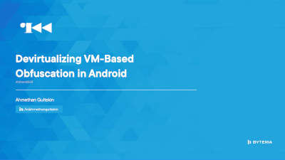
</a>

### <a name="mwemu">Debugging emulated processes with mwemu</a>

(sha0)

Windows process emulation was already possible with mwemu, and in most of cases was very effective for emulating small group of functions, decrypting stuff, etc. However full-emulation of the malware was something like an utopia. Latest improvements by mwemu team alow the reverser do analysis with radare2 from inside the emulated process. This is useful for inspecting memory data chunks, but also code analysis, functions recognizement, decompilers, ai, or any of the zillions of radare2 features.

<a href="day1">
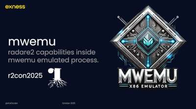
</a>

### <a name="chameleon">Chameleon: polymorphic engine for position independent shellcode</a>

(gum3t)

Chameleon is a polymorphic engine for `x86_64` position-independent shellcode that has been created out of the need to evade signature-based detections in red team environments.

<a href="day1">
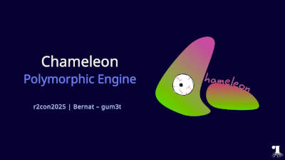
</a>

### <a name="close0">Closing Day</a>

(pancake)

See you tomorrow!

# Saturday

### <a name="vacuum">Restoring the Vacuum</a>

(brainstorm+pancake)

We took apart an EOL'd vacuum cleaner and reverse engineered it from hardware to firmware, building our own custom system to gain full control over the main compute board. This talk walks through the entire process — from capturing hardware traces and identifying peripherals to using AI tools to analyze an ARM32 firmware and recover working source code. Expect practical insights where electronics, reverse engineering, and LLMs come together to bring "old" devices back to life.

<a href="day2">

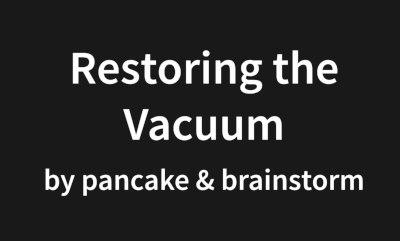

</a>

### <a name="solana">Reverse Engineering Solana Programs with radare2</a>

(ulexec + secoalba)

Solana programs execute inside a custom virtual machine built on top of sBPF, a modified version of eBPF optimized for parallel transaction processing.

In this talk, we’ll break down the fundamentals of Solana’s runtime model, including its account-based architecture, program input serialization, and execution pipeline, to understand how transactions reach and interact with on-chain programs. From there, we’ll explore the sBPF ISA, memory layout, relocation mechanism, and syscall interface, as an overview of the building blocks of Solana’s execution environment.

Finally, we’ll demonstrate the new set of sBPF plug-ins for radare2, which enables disassembly, syscall name resolution, and Rust string detection for Solana programs for sBPF v0, v1, v2 and v3. We’ll walk through how these capabilities can help security researchers analyze Solana programs without source-code, and conclude with a short roadmap for upcoming improvements.

<a href="day2">
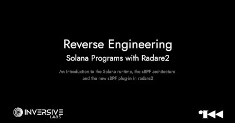
</a>

### <a name="parse">Refreshing the state of parsing disassembly</a>

(satk0)

Parsing disassembly has been always a quick and dirty way to extract information from the code, but also to improve the readability replacing inmediates with symbolic information like local variables or function names. This feature has been also very useful for translating any architecture into pseudocode which let high level decompilers like Decai to handle lots of targets with very little effort. During the transition from 5.9 to 6.0, radare2 changed the way these APIs work and improved the state of the art by introducing plugins and generic APIs to help developers reduce code complexity and maintainability while producing more solid results.

<a href="day2">
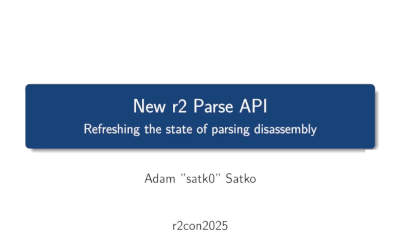
</a>

### <a name="toctou">TocTou Maps</a>

(pancake)

Accessing buffers is always tricky—especially when mmap comes into play. This talk dives into a subtle bug in radare2 that uncovered a series of non-portable syscalls and broader portability issues. Along the way, we’ll explore how operating systems manage memory and how these details can lead to vulnerabilities in modern software. If you’re curious about low-level memory handling and hidden pitfalls, this is a session you won’t want to miss.

<a href="day2">
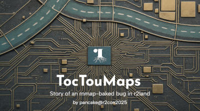
</a>

### <a name="rasp">Reversing Android RASP using Radare2 & Frida</a>

(apkunpacker)

Practical use of radare2 and Frida for efficient analysis of RASP checks during reverse engineering. This presentation demonstrates manually invoking init_array to decrypt strings and locating and hooking mprotect to expose runtime-mapped memory regions that contain RASP checks.

<a href="day2">
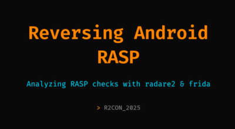
</a>

### <a name="morph">Automated Binary Morphing and Evasion Analytics</a>

(seilfreed)

This talk introduces r2morph, a framework for transforming binaries while preserving their behaviour. Built on radare2, it performs semantic-aware mutations such as instruction substitution, NOP insertion, and control-flow flattening. We’ll explore its architecture, multi-architecture support, and practical uses in obfuscation, evasion testing, and binary research, with live examples of extending it through custom mutation passes.

<a href="day2">
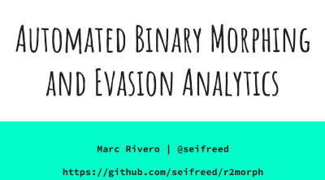
</a>

### <a name="r2web">Accessing radare2 from anywhere, anytime</a>

(AbhiTheModder)

Introduction to r2web, which brings the webassembly builds radare2 to the browser while still being totally client-side, enabling quick, setup-free reverse engineering for education, collaboration, and lightweight analysis. We'll also cover current limitations and future plans for cross-platform improvements.

<a href="day2">
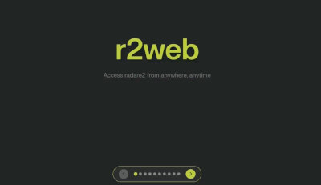
</a>

### <a name="rfs">Revamping rfs</a>

(mikelloc)

Join us for a fast-paced overview of the recent enhancements to radare2’s filesystem library. We’ll explore the addition of UBIFS support, the introduction of a visual, interactive interface for filesystem navigation, and new capabilities for extracting metadata and recovering on-disk file locations. Learn how these improvements fill in the missing bits and open up new possibilities for filesystem analysis, debugging, and forensics in radare2.

<a href="day2">
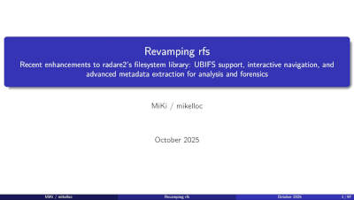
</a>

### Closing Event

(pancake)

So long and thanks for the tofu!

--pancake

